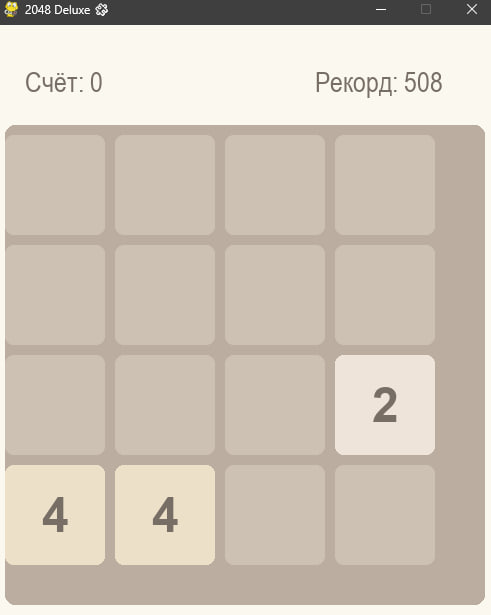

# 🧩 ИГРА 2048 

🎮 **Скачайте и сразу играйте:** [**СКАЧАТЬ ИГРУ (.EXE)**](https://github.com/ТВОЙ_НИК/2048-python-game/releases/latest/download/game_2048.exe)

Классическая логическая игра **2048**, созданная на **Python** с использованием **Pygame**.

Просто скачай файл `game_2048.exe` и запусти — игра готова!  
- Экран “Ты проиграл” с кнопками **Заново** и **Выход**  
- Красивый интерфейс и плавная графика  
- Счёт и рекорд сохраняются между играми  

---

## 🖼️ СКРИНШОТ ИГРЫ

---

## 🕹️ ОСОБЕННОСТИ
- ✅ Играть можно без установки Python  
- ✅ Счёт и рекорд сохраняются  
- ✅ Экран “Ты проиграл” с кнопками  
- ✅ Адаптивный и красивый интерфейс  

---

## 👨‍💻 АВТОР ПРОЕКТА
**Rikoni**  S
📧 Email: **rikoniwww@gmail.com**  
🌐 GitHub: [github.com/Rikoniii](https://github.com/Rikoniii)

---

## 📢 ПРОДВИЖЕНИЕ ПРОЕКТА
Если игра понравилась:  
- ⭐ Поставьте звёздочку на GitHub  
- 🔁 Поделитесь ссылкой с друзьями  
- 💬 Оставьте комментарий или предложите улучшения в разделе Issues  

---

© 2025. Все права защищены.
